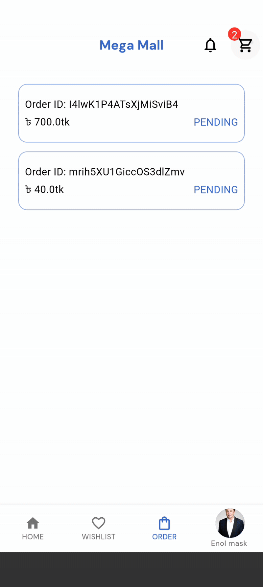

# E-Commerce App ( Flutter )

An e-commerce flutter app with Firebase Auth, Firestore and Bloc ( Cubit ) state-management.
Features of this app is given below:
 - Product list
 - Filter product based on categories
 - Wishlist
 - Cart
 - News article
 - User authentication ( Login, Registration )

## A quick demonstration of features

### Home Screen

### Category Screen

### Wishlist

### Add to cart

### Checkout and Orders Screen

### News Screen

